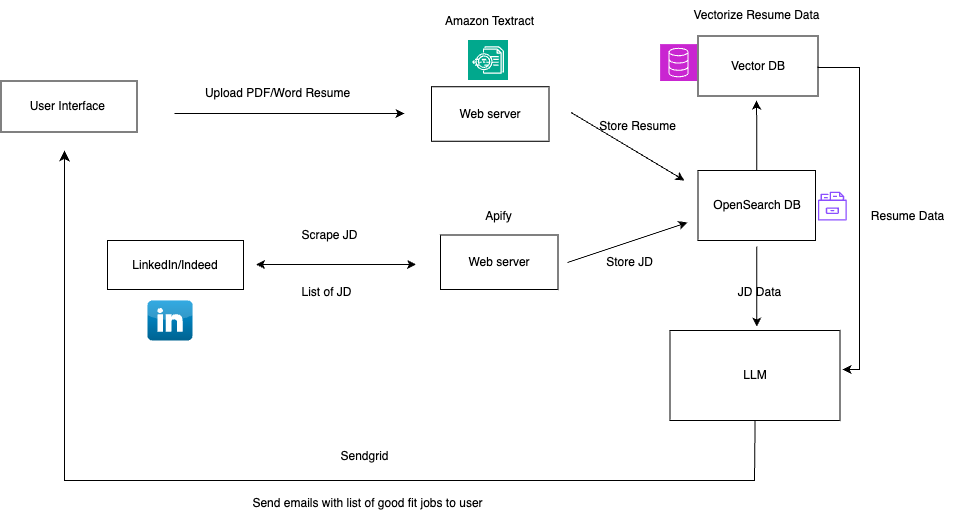

## Business Problem
Considering the extensive volume of job openings, job seekers often spend a significant amount of time browsing, searching, and scanning through countless job positions, resulting in an inefficient use of their time. To address this issue, we have introduced a job matching recommendation engine aimed at enhancing the efficiency of the job-seeking process. The system will allow users to upload the resume with their job position preference in the frontend application, scrape the most recent job positions from recruiting websites, utilize advanced language models to match resumes with job descriptions and eventually send out the notifications to users with the appropriate positions.

## Metrics 

Click-Through Rate: % of recommendations clicked by the job seeker

Precision Rate: This will measure the accuracy of the match between the job positions and the user's resume.

## Data

To create this solution, two types of data are necessary. The first type is student data, where students will upload their resumes in PDF or Word format to the application. Additionally, students will provide personal information such as their name, email, phone number, preferred job positions, desired job locations, and salary expectations. Once the application collects this data, various transformations will be applied, and the student data will be stored in a cloud database.
The second type of data pertains to job position information. The system incorporates a feature to extract job position data from various recruiting websites. It will automatically scrape the latest job postings on a daily basis and store it in ElasticSearch.

## AWS Reference Architecture Diagrams

